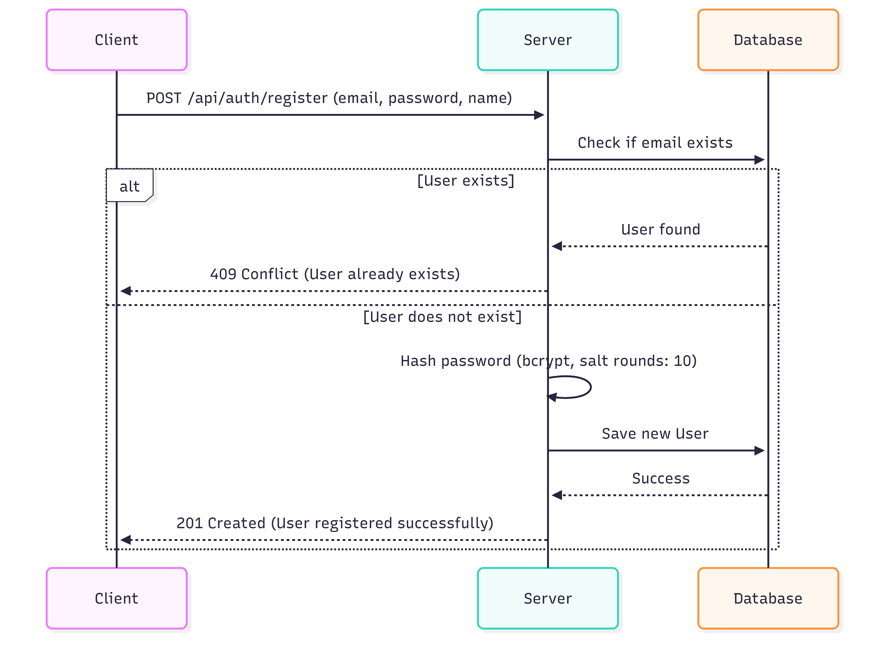
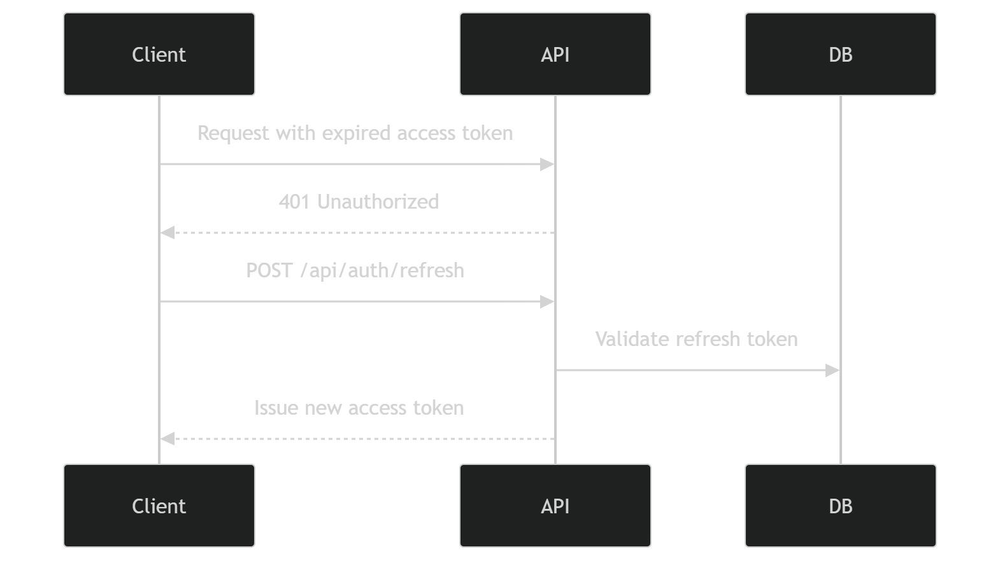
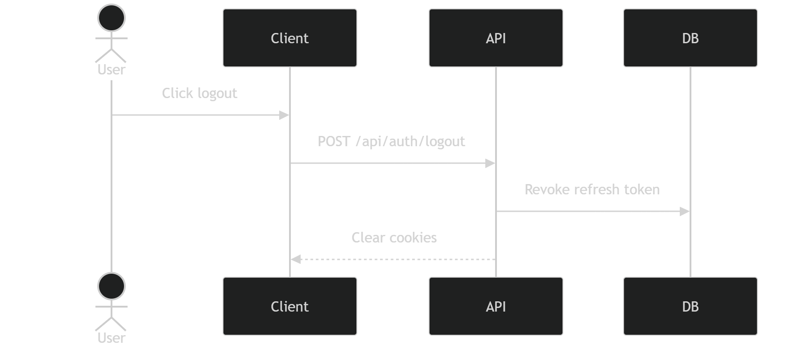
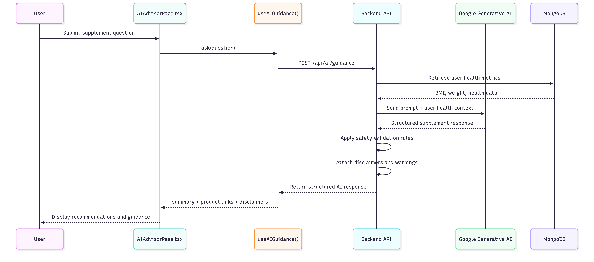
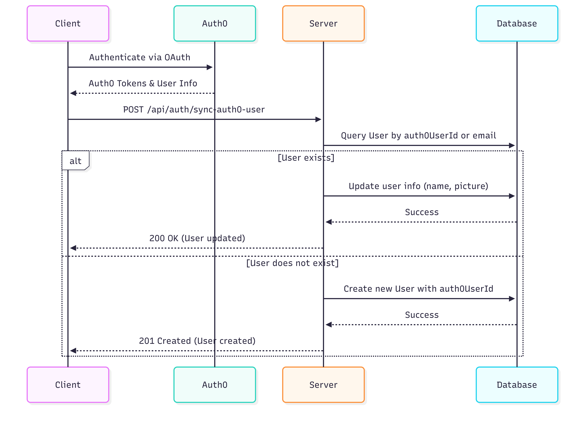
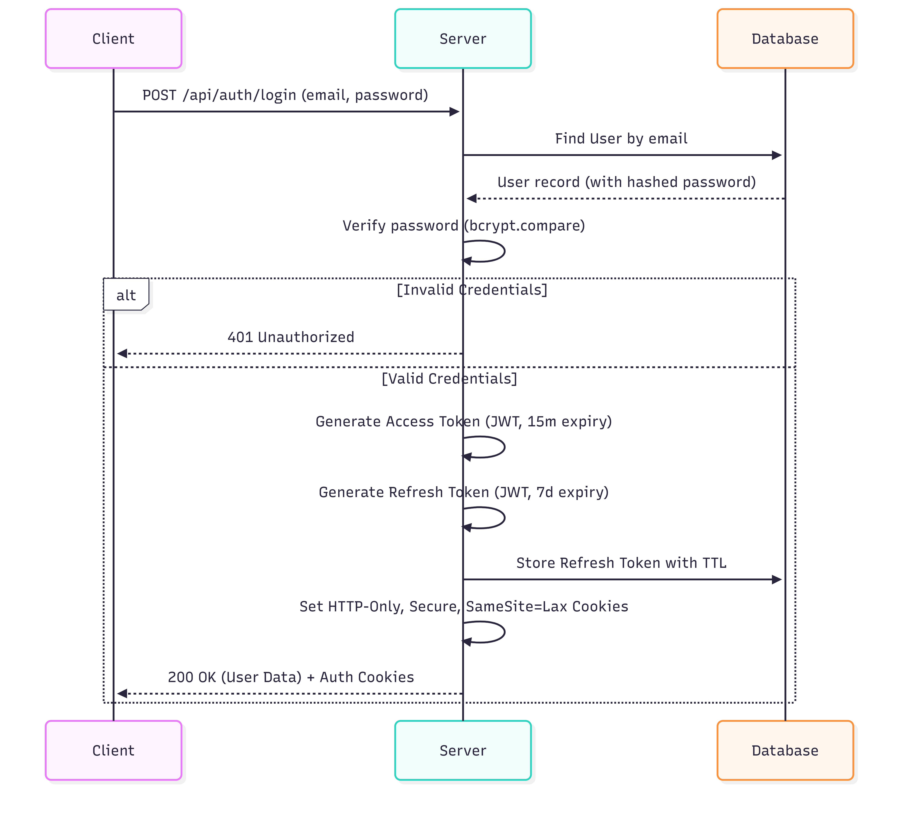

# Vital Box

Vital Box is a full-stack health and fitness web application focused on
**personalized supplement recommendations and health tracking**. The
platform analyzes a user's **BMI, weight, goals, and health context** to
generate structured supplement suggestions through an AI advisor.

Rather than promoting trends or generic supplement stacks, Vital Box
focuses on **safer, context-aware recommendations** supported by logic
checks and medical disclaimers. The system helps users understand what
supplements may align with their goals while also providing visibility
into their health progress over time.

------------------------------------------------------------------------

## Table of Contents

-   What is Vital Box?
-   Why Vital Box Exists
-   Architecture Overview
-   Authentication & Security
-   Key Features
-   API Reference
-   Security Considerations
-   Project Website
-   Contributing
-   License

------------------------------------------------------------------------

## What is Vital Box?

Vital Box is a **health tracking and supplement recommendation
platform** that combines biometric data with AI-assisted guidance.

Users provide health inputs such as **weight, BMI, and personal fitness
goals**, and the system generates supplement suggestions tailored to
those metrics. The AI advisor can also respond to personalized user
requests while applying safety-oriented logic and structured
disclaimers.

The goal of the platform is to help users navigate the overwhelming
supplement market by providing **clearer, personalized, and more
responsible guidance** rather than generic advice.

------------------------------------------------------------------------

## Why Vital Box Exists

The global supplement industry is massive, but the process of choosing
supplements remains confusing for most people. Consumers often rely on
social media trends, marketing claims, or incomplete information when
deciding what products to use.

Vital Box was designed to address several key issues:

| Problem | Approach |
|---|---|
| Consumers struggle to understand which supplements align with their personal health goals | Use biometric inputs (BMI, weight, goals) to tailor recommendations |
| Supplement advice online is often generic or trend-driven | Provide contextual suggestions based on user-specific data |
| Safety risks exist when combining supplements incorrectly | Include logic checks and safety disclaimers in AI recommendations |
| Health progress is difficult to visualize over time | Provide tracking for BMI, weight history, and goal progress |

The system focuses on **guidance and tracking**, not selling products, allowing users to independently decide where to purchase recommended supplements.

------------------------------------------------------------------------

## Architecture Overview

CLIENT (Next.js / React)

-   HomePage
-   BMI Calculator
-   AI Advisor
-   User Dashboard

Requests are routed through a middleware layer responsible for security
and rate limiting before reaching backend API routes. Data is stored in
MongoDB and the AI recommendation system communicates with an external
AI provider to generate supplement guidance.

------------------------------------------------------------------------

## Authentication & Security

Vital Box uses a **dual-token JWT authentication system**. Tokens are
stored in `httpOnly` cookies to prevent JavaScript access and reduce XSS
risks.

### Sign Up Flow

User submits name, email, and password. The backend validates the
request, checks for duplicate accounts, hashes the password, and stores
the user record in the database.

### Sign In Flow

Credentials are validated against stored password hashes. If
authentication succeeds, the server issues an **access token and refresh
token** stored securely as cookies.

### Token Refresh

Short-lived access tokens are refreshed automatically using a refresh
token when they expire, allowing users to remain logged in without
repeated authentication.

### Logout

Logout clears authentication cookies and revokes refresh tokens stored
in the database.

------------------------------------------------------------------------

## Key Features

### AI-Based Supplement Guidance

Users can ask health-related questions or request supplement
suggestions. The AI advisor analyzes BMI, weight, goals, and user
context before returning structured recommendations with safety
disclaimers.

### AI Advisor System

The **AI Advisor (AIAdvisorPage.tsx)** is the core intelligence layer of
Vital Box. It delivers personalized supplement recommendations using a
combination of user health metrics, structured safety rules, and
large-language model reasoning.

The advisor integrates **Google Generative AI** with internal
verification logic to generate safe, contextual supplement guidance.

Inputs used by the advisor include:

- User BMI and BMI category
- Current weight and measurement system
- Fitness goals and user questions
- Health context stored in the user profile

The system generates structured responses that may include:

- Recommended supplements
- Product search suggestions
- Safety warnings or red flags
- Medical disclaimers
- External product links for further research

All recommendations are generated dynamically and include safeguards
designed to reduce unsafe supplement combinations or unrealistic
dosage advice.

### AI Recommendation Flow

The following sequence diagram illustrates how the AI advisor processes
a user request and generates supplement guidance.

### BMI and Weight Tracking

Each BMI calculation is saved as part of the user's health history. This
allows tracking changes in BMI and weight progress over time.

### Health Dashboard

Users can view their health metrics, track weight goals, and monitor BMI
history through dashboard visualizations.

### Secure User Authentication

Accounts are protected through encrypted passwords, token-based
authentication, and secure cookie handling.

------------------------------------------------------------------------

## API Reference

### Authentication

| Method | Endpoint | Description |
|---|---|---|
| POST | /api/auth/register | Register new user |
| POST | /api/auth/login | Authenticate user |
| POST | /api/auth/refresh | Refresh access token |
| POST | /api/auth/logout | End session |

-----------------------------------------------------------------------
### User

| Method | Endpoint | Description |
|---|---|---|
| POST | /api/user/metrics | Save BMI and weight data |

------------------------------------------------------------------------
### AI

| Method | Endpoint | Description |
|---|---|---|
| POST | /api/ai/guidance | Generate supplement recommendations |

------------------------------------------------------------------------

## Security Considerations

| Topic | Implementation |
|---|---|
| Token Storage | httpOnly cookies |
| Password Security | bcrypt hashing |
| Rate Limiting | Request limits applied via middleware |
| API Key Protection | External AI API keys stored server-side |
| Role Verification | Server-side checks on protected routes |

------------------------------------------------------------------------

## Project Website

The application is hosted online and can be accessed here:

Project Link: https://vital-box.vercel.app

This repository contains the source code for the platform.

------------------------------------------------------------------------

## Contributing

Contributions are welcome.

If you are interested in contributing to the project, please reach out
to the developers currently maintaining the repository before submitting
large changes or new features.

You may open an issue to discuss ideas or improvements.

------------------------------------------------------------------------

## License

MIT License

© 2026 Vital Box
